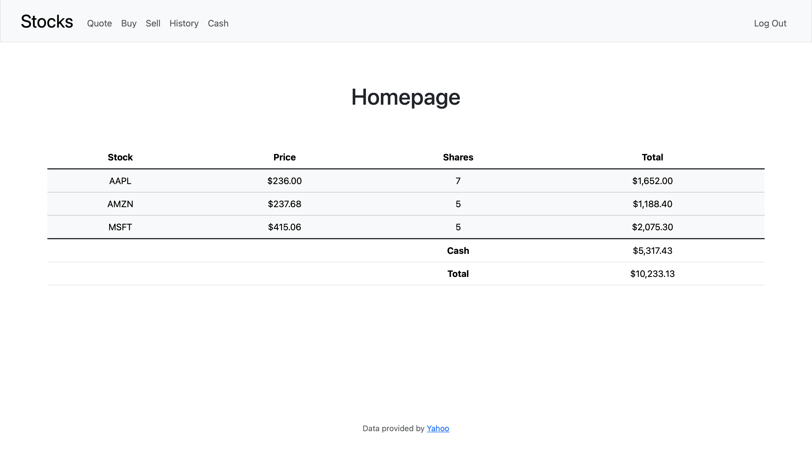

# Stocks




## 📈 Description
Stocks is a web application built using Python and Flask that allows users to manage and track simulated stock investments. Users can buy, sell, and view their transaction history, check current stock prices, and manage their cash balance.

## ✨ Features
- Portfolio with current stock holdings. 
- Purchase and sell simulated stocks.
- Check real-time prices of any stock.
- View a history of all your stock transactions.
- Add funds to your cash balance.
- Responsive and user-friendly design optimized for desktops, tablets, and mobile phones.

## 🖥️ Usage
1. Register a new account or log in if you already have one.
2. Home – View your portfolio: stocks, values, and total balance.  
3. Quote – Enter a stock symbol to see its current price.  
4. Buy – Enter a stock symbol and number of shares to purchase; your cash balance updates automatically.  
5. Sell – Select a stock and number of shares to sell; balance updates instantly.  
6. History – See all past transactions.
  
## 🛠️ Development Setup

### Prerequisites
- Python 3.x
- Flask
- SQLAlchemy

### Installation
1. Clone the repository:

    ```bash
    git clone https://github.com/joherrer/stocks.git
    ```

2. Navigate to the project directory:

    ```bash
    cd stocks
    ```

3. Create a virtual environment (optional but recommended):


    ```bash
    python3 -m venv venv
    ```

4. Activate the virtual environment:

    ```bash
    # Linux/macOS
    source venv/bin/activate
    ```

    ```bash
    # Windows
    venv\Scripts\activate
    ```
    
5. Install the required packages:

    ```bash
    pip install -r requirements.txt
    ```

6. Start the Flask application:

    ```bash
    flask run
    ```

7. Open your browser and go to `http://127.0.0.1:5000`.

## 🗒️ Notes
- This app uses SQLite as the database system and SQLAlchemy as the ORM to manage users, transactions, and stock data.

- The app uses Flask-Session for session management and Werkzeug for secure password hashing and user authentication.

- The stock price data is fetched from an external API (Yahoo Finance).

## 📜 License
Copyright (c) 2025 Jose Herrera. All rights reserved.
